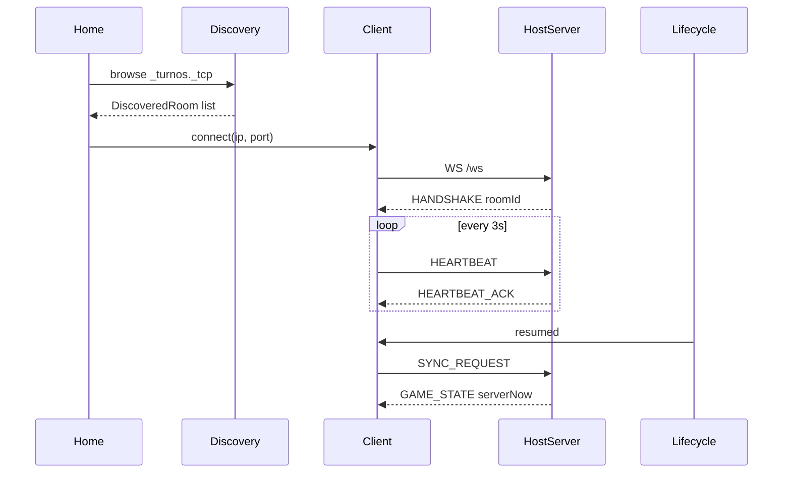

# Design: MVP LAN Host, Discovery, and MVP+ Lifecycle

## Technical Approach

Greenfield Flutter app: **Shelf** embedded WebSocket host + **Bonsoir** mDNS + **flutter_foreground_task** (Android FGS). Implements specs `lan-discovery`, `lan-transport`, `app-lifecycle-sync`. Spike proves 2-device LAN; stub `GAME_STATE` with `serverNow` prepares timer sync in a later change. State: **Riverpod**; routing: **go_router** (minimal).

## Architecture Decisions

| Decision | Choice | Alternatives | Rationale |
|----------|--------|--------------|-----------|
| LAN stack | Shelf + Bonsoir | shelf_plus, all-in-one LAN pkg | Exploration winner; full protocol control |
| State | Riverpod | flutter_bloc | Plan default; simple providers for spike |
| Host bind | `anyIPv4`, ephemeral port | Fixed 8080 | Avoid conflicts; port in mDNS TXT |
| Heartbeat | 3 s interval, 8 s timeout | 5 s / 10 s | Within spec band; balances battery |
| mDNS rollback | `kEnableMdns` const | Runtime toggle only | Compile-time rollback per proposal |
| FGS type | `connectedDevice` | dataSync | Play policy for LAN game host |
| iOS host | Banner only, no FGS | Silent audio | App Store risk; out of scope |

## Data Flow



```
HostRoomController
  ├── WebSocketHostServer (Shelf /ws)
  ├── MdnsAdvertiser (Bonsoir broadcast)
  └── ForegroundServiceBridge (Android, IN_GAME only)

HomeScreen
  ├── MdnsBrowser → merge with ManualEndpointStore
  └── SpikeConnectAction → GameSocketClient
```

## WebSocket Message Contract (this change)

Envelope (all messages):

```json
{ "type": "MESSAGE_TYPE", "payload": { } }
```

| type | Dir | payload (key fields) |
|------|-----|----------------------|
| `HANDSHAKE` | H→C | `roomId`, `displayName`, `serverNow` |
| `HEARTBEAT` | C↔H | `deviceId`, `clientNow` |
| `HEARTBEAT_ACK` | H→C | `serverNow` |
| `PING` / `PONG` | C↔H | `{}` (spike) |
| `SYNC_REQUEST` | C→H | `deviceId` |
| `GAME_STATE` | H→C | `serverNow`, `gamePhase`, `roomId`, `stubVersion` |
| `START_GAME` | H local | triggers `gamePhase=IN_GAME` + FGS (spike) |
| `END_GAME` | H local | stops FGS; `gamePhase=ENDED` |

**GAME_STATE stub** (no timer fields yet):

```json
{
  "type": "GAME_STATE",
  "payload": {
    "roomId": "uuid",
    "serverNow": 1710000000123,
    "gamePhase": "IN_GAME",
    "stubVersion": 1
  }
}
```

Full timer fields (`turnStartedAt`, `phase`, etc.) added in change `game-timer-sync`. **Forward-compat:** clients ignore unknown payload keys.

## Timer State Machine (stub)

This change only models `gamePhase` for FGS/lifecycle gating:

```
LOBBY → IN_GAME (START_GAME) → ENDED (END_GAME)
```

`IN_GAME` enables Android FGS on host and iOS host banner. Per-turn phases (`NORMAL` / `WARNING` / `EXCEEDED`) and `PAUSED` are **out of scope** — see plan `pausa_partida_host`.

## MVP+ Lifecycle

| Role / OS | Behavior |
|-----------|----------|
| Android host + `IN_GAME` | Start FGS via `ForegroundServiceBridge.start()` |
| Android host + `END_GAME` | `ForegroundServiceBridge.stop()` |
| iOS host + `IN_GAME` | `HostKeepOpenBanner` widget on spike/game screen |
| All clients | `AppLifecycleSyncCoordinator` implements `WidgetsBindingObserver` |
| `resumed` + session active | Reconnect if needed → `SYNC_REQUEST` → apply `GAME_STATE` |
| Background | Stop timer interpolation; heartbeats continue if socket alive |

FGS notification copy (es/en): *"Partida activa — Turnos Juegos de mesa"*.

## Catalogs (reference — not implemented this change)

Per master plan; used by later lobby/profile changes:

| Colors (`color_1`…`color_8`) | red, orange, yellow, green, cyan, blue, violet, pink |
| Sounds (`sound_1`…`sound_8`) | `assets/sounds/sound_N.mp3` |

Placeholder in `lib/core/catalogs/` for future slices.

## File Changes

| File | Action | Description |
|------|--------|-------------|
| `pubspec.yaml` | Create | Flutter + deps (pinned in apply) |
| `lib/main.dart` | Create | App entry |
| `lib/app/app.dart` | Create | MaterialApp, ProviderScope |
| `lib/core/constants/network_constants.dart` | Create | `kEnableMdns`, heartbeat, service type |
| `lib/core/models/ws_envelope.dart` | Create | Envelope encode/decode |
| `lib/core/models/discovered_room.dart` | Create | `roomId`, `displayName`, `hostIp`, `port` |
| `lib/core/models/spike_room_stub.dart` | Create | In-memory host room |
| `lib/server/websocket_host_server.dart` | Create | Shelf + `/ws` handler |
| `lib/server/host_room_controller.dart` | Create | Orchestrates server, mDNS, sessions |
| `lib/core/network/game_socket_client.dart` | Create | Connect, send, heartbeat, reconnect |
| `lib/core/network/discovery/mdns_advertiser.dart` | Create | Bonsoir broadcast |
| `lib/core/network/discovery/mdns_browser.dart` | Create | Bonsoir browse |
| `lib/core/network/manual_endpoint_store.dart` | Create | SharedPreferences IP:port |
| `lib/core/lifecycle/app_lifecycle_sync.dart` | Create | Observer + SYNC_REQUEST |
| `lib/core/lifecycle/foreground_service_bridge.dart` | Create | flutter_foreground_task wrapper |
| `lib/features/home/home_screen.dart` | Create | Room list + spike connect |
| `lib/features/spike/spike_session_screen.dart` | Create | PING + lifecycle test UI |
| `android/.../AndroidManifest.xml` | Modify | INTERNET, FGS, notifications |
| `ios/Runner/Info.plist` | Modify | `NSLocalNetworkUsageDescription`, `NSBonjourServices` |

## Interfaces

```dart
class WsEnvelope {
  final String type;
  final Map<String, dynamic> payload;
}

abstract class WebSocketHostServer {
  Future<int> start({required String roomId, required MessageHandler onMessage});
  Future<void> stop();
  void broadcast(WsEnvelope envelope);
}

abstract class MdnsAdvertiser {
  Future<void> start({required String roomId, required String displayName, required int port});
  Future<void> stop();
}

class AppLifecycleSyncCoordinator with WidgetsBindingObserver {
  void onResumed(void Function() sendSyncRequest);
}
```

## Platform Config

**Android:** `FOREGROUND_SERVICE`, `FOREGROUND_SERVICE_CONNECTED_DEVICE`, `POST_NOTIFICATIONS` (API 33+), `INTERNET`, `ACCESS_WIFI_STATE`, `CHANGE_WIFI_MULTICAST_STATE`.

**iOS Info.plist:**
- `NSLocalNetworkUsageDescription` (es/en strings)
- `NSBonjourServices`: `_turnos._tcp`

## Testing Strategy

| Layer | What | Approach |
|-------|------|----------|
| Unit | `WsEnvelope` parse, heartbeat timeout logic | `flutter test` after scaffold |
| Widget | Home room list merge (mDNS + manual) | Mock discovery provider |
| Manual E2E | 2 physical devices | Spike checklist in tasks.md |
| Analysis | `dart analyze` | CI gate post-scaffold |

`strict_tdd: false` — tests added with implementation, not blocking spike.

## Migration / Rollout

No data migration. Feature flags: `kEnableMdns`, `kEnableForegroundService`. Rollback per proposal §Rollback Plan.

## Open Questions

- [ ] Pin exact `bonsoir` / `flutter_foreground_task` versions at `flutter create` (apply phase).
- [ ] Multicast lock needed for Bonsoir browse on some Android OEMs — add `flutter_multicast_lock` only if spike fails.

## Next Step

`/sdd-tasks` — slice: scaffold → host server → discovery → client spike → lifecycle/FGS → 2-device sign-off.
