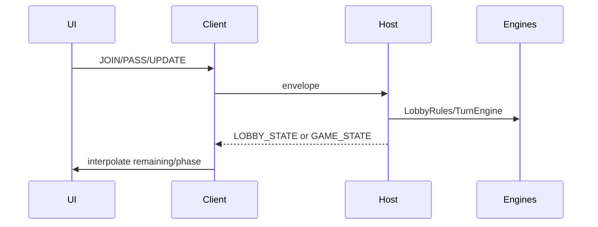

# Design: MVP Lobby + Authoritative Turn Timer

## Technical Approach

Approach **B** on archived LAN stack (Shelf `/ws`, Bonsoir, FGS, Riverpod, go_router). Replace `SpikeRoomStub` with `GameRoom`; extract pure `LobbyRules` + `TurnEngine`. Features: `player_profile`, `lobby`, `game`. Demote spike. Reuse envelope, heartbeat, mDNS, `ClientSyncState`, FGS on `IN_GAME`/`END_GAME`. Specs: `lobby`, `turn-timer`, delta `lan-transport`.

## Architecture Decisions

| Decision | Choice | Rejected | Rationale |
|----------|--------|----------|-----------|
| Domain | `GameRoom` | Keep stub | Needs seats + timer fields |
| Host logic | Pure `LobbyRules` + `TurnEngine` | All in controller | Unit tests; avoid god-object |
| Exclusivity | Picker = free ∪ own; host silent-ignore taken | `UPDATE_PLAYER_REJECTED` | Locked mid-spec |
| Sync | Interpolate `serverNow` + `turnStartedAt` | Client wall clock | Clock skew |
| Delivery | Chained PRs profile→lobby→timer | Single PR | 400-line budget |
| Spike | Debug-gate / demote | Primary path | Tester confusion |

## Domain Model

| Type | Fields |
|------|--------|
| `LocalPlayerProfile` | `defaultDisplayName`, `preferredColorIds[3]`, `preferredSoundIds[3]` |
| `GameRoom` | `roomId`, `displayName`, `hostPlayerId`, slots, `turnSequence`, config, `gamePhase`, players |
| `Player` | `playerId`, name, `colorId`, `soundId`, `deviceId`, `connected`, excess counters |
| `RoomConfig` | duration 15–600/5 def60; increment 0–120 def0; `variableTurnOrder` def false; max 2–8 |
| `TurnState` | `activePlayerId`, `turnStartedAt`, round, base/current duration, turn `phase` |
| Catalogs | `color_1…8`; `sound_1…8` → `assets/sounds/` (mute stubs OK) |

`GamePhase`: `LOBBY` | `IN_GAME` | `BETWEEN_ROUNDS` | `ENDED`.

Join prefs (color & sound independent): 1st free → 2nd → 3rd → any free.

```
HostRoomController → WebSocketHostServer / mDNS / FGS
                  → LobbyRules (join/update/compact/config/reorder)
                  → TurnEngine (start/pass/phase/rounds/excess)
```

## WebSocket Contracts

Envelope `{type,payload}`. **No** required `UPDATE_PLAYER_REJECTED`.

| type | Dir | Payload |
|------|-----|---------|
| Transport keep | — | HANDSHAKE, HEARTBEAT/ACK, SYNC_REQUEST |
| `JOIN` | C→H | deviceId, displayName, preferredColorIds, preferredSoundIds |
| `JOIN_ACK` | H→C | playerId, slotNumber, assignedColorId, assignedSoundId |
| `LEAVE` / `PLAYER_REMOVED` | C→H / H→all | playerId |
| `LOBBY_STATE` | H→all | config, slots, turnSequence, playersById; **every lobby mutation MUST broadcast and all devices (host + clients) MUST refresh UI from the latest snapshot** |
| Host config | H | SET_ROOM_DISPLAY_NAME (+mDNS), SET_MAX_PLAYERS, SET_TURN_DURATION, SET_ROUND_INCREMENT, SET_VARIABLE_TURN_ORDER |
| `REORDER_SLOTS` / `REORDER_TURN_SEQUENCE` | H | ordered ids (lobby) |
| `UPDATE_PLAYER` | C→H | own name?/colorId?/soundId? |
| `DISCARD_ROOM` / `ROOM_DISCARDED` | H / H→all | roomId |
| `START_GAME` | H | freeze → round 1 |
| `PASS_TURN` | C→H | active self, or host if active disconnected |
| `GAME_STATE` | H→* | sync fields below |
| `ROUND_COMPLETED` | H→all | currentRound, next duration preview |
| `REORDER_TURN_ORDER` | H | BETWEEN_ROUNDS only |
| `START_NEXT_ROUND` / `END_GAME` | H | resume / ENDED+teardown |
| PING/PONG | debug | optional |

## Timer State Machine

```
LOBBY → START_GAME → IN_GAME
  fixed last-pass → round++, duration=base+(r-1)*inc, stay IN_GAME
  variable last-pass → BETWEEN_ROUNDS → (REORDER?) → START_NEXT_ROUND → IN_GAME
  END_GAME → ENDED → ended screen → Home (FGS stop, teardown)

Turn: remaining = turnStartedAt + currentRoundDuration − serverNow
  NORMAL (r>15) → WARNING (0<r≤15) → EXCEEDED (r≤0; excess until pass → counters)
```

## UI + Sync

**Screens:** Personalización (defaults OK; empty name blocks foreign join) · Lobby (host config/reorder/Start K≥2; pickers from LOBBY_STATE eligible; **all lobby changes sync to every connected device including host**) · Game (active/waiting, flash ≤15s, exceeded solid, PASS tap; BETWEEN_ROUNDS host controls) · Ended (“Partida terminada” → Home) · Home wires lobby; spike not primary.

**GAME_STATE:** `serverNow`, `turnStartedAt`, `activePlayerId`, `phase`, round/durations, `variableTurnOrder`, `gamePhase`, players (+connected/excess), slots/`turnSequence`. Client resumes → `SYNC_REQUEST`. Lobby disconnect → compact; in-game → `connected=false`, keep slot; host MAY pass for disconnected active.



## File Map

| Path | Action |
|------|--------|
| `lib/core/models/{game_room,player,room_config,turn_state,local_player_profile}.dart` | Create |
| `lib/core/catalogs/{color,sound}_catalog.dart`, `domain/{lobby_rules,turn_engine}.dart`, `repositories/player_profile_repository.dart` | Create |
| `spike_room_stub.dart` | Retire after GameRoom |
| `message_types.dart`, `host_room_controller.dart`, `websocket_host_server.dart`, `game_socket_client.dart`, `client_sync_state.dart`, providers | Modify |
| `features/{player_profile,lobby,game}/`, `assets/sounds/` | Create |
| `home/`, `app.dart` | Wire routes; demote spike |
| `test/core/domain/*` + widget smoke | Create |

## Testing / Rollout

| Layer | Focus |
|-------|-------|
| Unit | LobbyRules prefs/compact/clamps; TurnEngine rounds/phases/excess; eligible picker set |
| Widget | Profile save; taken omitted; ended→Home |
| Manual | 2-device create/join/start/pass/end |

No migration. **Chained PR hint (tasks):** PR1 profile+catalogs+domain → PR2 lobby protocol/UI → PR3 TurnEngine+game/ended. Rollback = revert chain.

## Open Questions

- [ ] Sound stub: silent mp3 vs short tone
- [ ] Spike: debug const vs remove in PR3
- [ ] JOIN_ACK unicast: extend handler `send` vs new `sendTo`

## Next

`/sdd-tasks`
