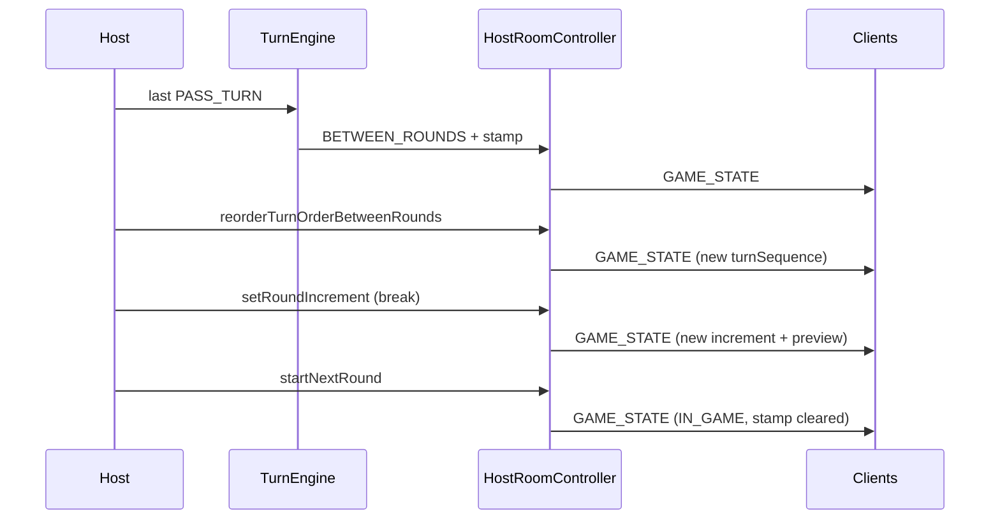

# Design: Between-rounds player order

Host-authoritative break screen for `variableTurnOrder`: fix phase gates, stamp break start time into `GAME_STATE`, let host reorder `turnSequence` and substitute `roundIncrementSeconds`, clients render the same state read-only.

## Technical Approach

Keep UI in `game_screen.dart` + reuse `LobbyReorderControls`. Fix domain so `BETWEEN_ROUNDS` can mutate sequence/increment. Mirror turn remaining: store `betweenRoundsEnteredAtMs`, clients derive elapsed via `serverNow` / `ClientSyncState.estimatedServerNowMs()`.

## Architecture Decisions

| Decision | Options | Choice | Rationale |
|----------|---------|--------|-----------|
| Phase gates | Broaden `_isLobbyHostMutable`; dedicated between-rounds APIs | **Dedicated gates** — do not widen lobby-only helper | Lobby must stay lobby-only for seats/colors/base duration/variable flag |
| Reorder validation | Against `slots`; against `turnSequence` | **`turnSequence` same-set** | Product: mutate sequence only; seats may diverge; disconnected IDs stay in sequence |
| Increment mutate | New field; mutate `config.roundIncrementSeconds` | **Substitute `config.roundIncrementSeconds`** | Already on `GAME_STATE`; next duration = previous duration + increment |
| Break clock | Local UI ticker; authoritative stamp | **`turnState.betweenRoundsEnteredAtMs` + `serverNow`** | Same pattern as `turnStartedAt`; SYNC-safe |
| Host increment API | Reuse `setRoundIncrement`; new method | **Reuse + phase-aware broadcast** | Lobby → `LOBBY_STATE`; break → `GAME_STATE` |
| Mid-drag sync | Per-frame; on completed action | **Broadcast after arrow / `onReorder` settle** | Matches Q2; avoids WS spam |
| Feature module | Extract BetweenRounds feature | **Stay in game screen** | Out of scope; smaller PR surface |
| Client mutations | WS `REORDER_TURN_ORDER` from clients | **Host-local controller only** | Message type exists; no client send path today |

## Data Flow

```
PASS_TURN (last in round, variableTurnOrder)
  → TurnEngine._closeRound
  → gamePhase=BETWEEN_ROUNDS
  → betweenRoundsEnteredAtMs = serverNowMs
  → ROUND_COMPLETED + GAME_STATE (incl. stamp, turnSequence, roundIncrementSeconds)

Host reorder / increment edit
  → domain gate (betweenRounds) → mutate → GAME_STATE broadcast

Client / acting-host UI
  → elapsed = estimatedServerNowMs() - betweenRoundsEnteredAtMs
  → list from turnSequence + playersById (show disconnected)

START_NEXT_ROUND
  → clear betweenRoundsEnteredAtMs → IN_GAME
```



## File Changes

| File | Action | Description |
|------|--------|-------------|
| `lib/core/domain/lobby_rules.dart` | Modify | Between-rounds sequence reorder (validate vs `turnSequence`); allow `trySetRoundIncrement` in lobby **or** betweenRounds; keep other mutators lobby-only |
| `lib/core/domain/turn_engine.dart` | Modify | Set/clear `betweenRoundsEnteredAtMs` in `_closeRound` / `tryStartNextRound` / `endGame`; keep `tryReorderTurnOrder` → new lobby_rules path |
| `lib/core/models/turn_state.dart` | Modify | Add `betweenRoundsEnteredAtMs` |
| `lib/core/models/game_room.dart` | Modify | Serialize/parse `betweenRoundsEnteredAt` in `toGameStatePayload` / `fromSnapshot` |
| `lib/core/lifecycle/client_sync_state.dart` | Modify | `betweenRoundsElapsedSeconds()` helper |
| `lib/server/host_room_controller.dart` | Modify | Phase-aware `setRoundIncrement` broadcast; ensure break entry uses same `serverNow` for stamp + payload |
| `lib/features/game/game_screen.dart` | Modify | Full between-rounds body: list, host reorder/increment, synced elapsed, start CTA; clients view-only |
| `lib/features/lobby/widgets/lobby_reorder_controls.dart` | Reuse | No API change |
| Domain/sync/game tests | Modify/Create | Gate, stamp, increment substitute, elapsed helper, UI host vs client |

## Interfaces / Contracts

**`GAME_STATE` addition (nullable outside break):**
```json
{ "betweenRoundsEnteredAt": 1710000000123 }
```

**Elapsed (all devices):** `floor((estimatedServerNowMs - betweenRoundsEnteredAt) / 1000)` clamped ≥ 0.

**Domain (non-obvious):**
- `LobbyRules.tryReorderTurnSequenceBetweenRounds(room, ids)` — requires `betweenRounds`; same player set as current `turnSequence`; mutates `turnSequence` only.
- `LobbyRules.trySetRoundIncrement` — allowed when `gamePhase ∈ {lobby, betweenRounds}`; still clamps to config min/max.
- Do **not** call lobby `tryReorderSeats` / `tryReorderSlots` from break UI.

**Host UI triggers:** `controller.reorderTurnOrderBetweenRounds`, `controller.setRoundIncrement`, `controller.startNextRound`. Acting host = device with active `HostRoomController` (`hostPlayerId`); succession needs no new branch.

## Testing Strategy

| Layer | What | Approach |
|-------|------|----------|
| Unit | Reorder/increment gates; stamp set/clear; preview after increment substitute | `turn_engine_test`, new `lobby_rules` cases |
| Unit | Elapsed from stamp + interpolated serverNow | `client_sync_state_test` |
| Widget | Host shows controls; client no mutate affordances | `game_screen` / feedback tests |
| Integration | Optional: controller broadcast after reorder/increment in break | `host_room_controller_test` if cheap |

## Migration / Rollout

No persisted migration. Missing `betweenRoundsEnteredAt` → treat as null / hide elapsed until next break entry. Rollback = revert PR chain.

## Auto-chain slices (`delivery_strategy: auto-chain`)

| PR | Scope | Done when |
|----|-------|-----------|
| 1 | Domain gates + `TurnState` stamp + payload/fromSnapshot + unit tests | Reorder/increment work in break; stamp round-trips; lobby gates unchanged |
| 2 | Host between-rounds UI (list, reorder, increment, elapsed, start) | Host can complete break flow |
| 3 | Client view-only + `ClientSyncState` elapsed + succession smoke | Clients match host list/timer/increment; acting host gets controls |

Forecast: **400-line budget risk High** → chained PRs required.

## Open Questions

- None blocking. Spec deltas for freeze/reorder/timer run in parallel (`sdd-spec`).
