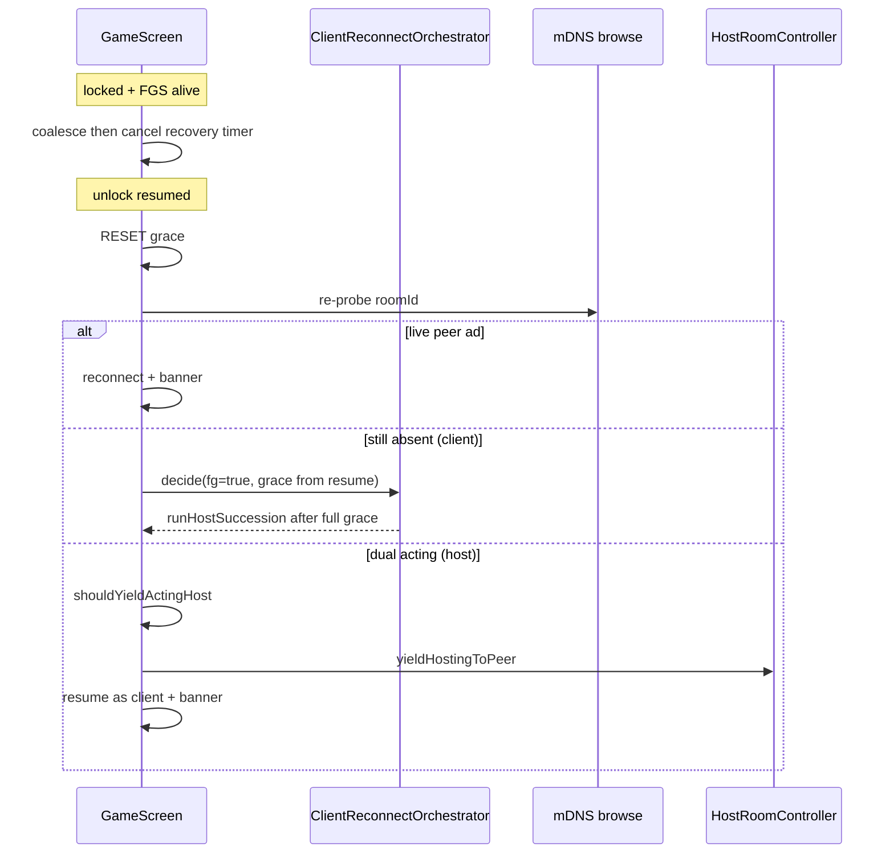

# Design: Pause-gated peer-local host succession

Gate succession on **sustained** foreground; on resume **RESET** grace, re-probe mDNS, reconnect or elect; heal dual acting-hosts toward original/live ads with **banner** UX. FGS unchanged.

## Technical Approach

Ship exploration **1+3+4**: GameScreen lifecycle coalesce + recovery-timer cancel; `ClientReconnectOrchestrator.decide` foreground guard; resume heal on **host and client** GameScreen; demote via existing `HostDemotionResume` / `_resumeAsClientAfterHostLost`. Specs (`host-succession`, `lan-discovery`, `app-lifecycle-sync`) decouple FGS keep-alive from succession eligibility. iOS claims OOS; foreground host-kill ≤ `kHostLossGraceMs` (3s) unchanged.

## Architecture Decisions

| Decision | Options | Choice |
|----------|---------|--------|
| Gate ownership | UI-only vs orchestrator-only vs both | **Both**: GameScreen cancels timer after coalesce; `decide(isForeground:)` returns `keepRetrying` when false (unit-testable; no succession call sites slip) |
| Grace on resume | Freeze vs RESET | **RESET** `_clientDisconnectStartedAt` (and restart recovery clock) on `resumed` |
| Inactive thrash | Immediate pause vs coalesce | **Coalesce ~400ms** (`kLifecyclePauseCoalesceMs`) before canceling recovery; motion/`_appInForeground` still updates immediately |
| Coalesce location | `AppLifecycleSync` vs GameScreen | **GameScreen-only** so sensors/SYNC pause behavior stays unchanged |
| Split-brain heal | Client-only vs host+client | **Host + client** resume paths |
| Heal preference | First-seen vs original vs turnSequence | Prefer **originalHostPlayerId** peer if advertised; else live peer ad; dual-acting tie-break **lowest `turnSequence` index** yields |
| Post-demote TCP fail | Re-succession vs client retry | **Client recovery only** (suppress succession until connected or a *new* full foreground grace with no live ads) — mirror `_hostMigrationInFlight` |
| Heal UX | SnackBar vs session banner | **Reuse** `GameSessionBanners` local reconnect strip (`Reconectando con el host…`) |
| FGS / iOS / ≤3s kill | Expand / claim / change | **No** FGS expand; iOS OOS; foreground ≤3s path intact |

## Ownership

| Component | Responsibility |
|-----------|----------------|
| `GameScreen` | Coalesce timer; cancel/restart `_clientRecoveryTimer`; grace RESET; client resume mDNS re-probe; host resume heal; demote → client navigate; banner wiring |
| `ClientReconnectOrchestrator` | Pure policy: mDNS + grace + `isForeground` |
| `HostSuccessionCoordinator` | Pure `shouldYieldActingHost` (original / turnSequence tie-break) |
| `HostRoomController` | `yieldHostingToPeer` → set `HostDemotionResume` + clear authority + `stopRoom(stopForegroundService: false)` |
| `AppLifecycleSync` | Unchanged non-foreground map |
| `room_discovery` | Existing `findLiveRoomAdvertisement(excludeHost/Port)` |
| `GameSessionBannerTexts` | Existing reconnect copy (no new toast path) |

## Data Flow

### Pause / lock (client reconnecting)

```
inactive/paused/hidden
  → motion off immediately (_appInForeground=false)
  → after coalesce ~400ms still non-fg
       → cancel recovery timer; no decide/succession
```

### Resume (client still reconnecting)

```
resumed
  → cancel coalesce; _appInForeground=true
  → RESET grace clock
  → ensure mDNS browse; findLiveRoomAdvertisement(roomId)
       match → _reconnectToEndpoint + SYNC (banner via reconnecting)
       none  → restart recovery timer; succession only after full fg grace
```

### Resume heal (acting/original host GameScreen)

```
resumed + isHost + in-progress
  → browse exclude self
  → if peer ad for same roomId AND shouldYieldActingHost
       → yieldHostingToPeer(peer) → _resumeAsClientAfterHostLost
       → TCP fail → client retry only (no immediate succession)
```



## File Changes

| File | Action | Description |
|------|--------|-------------|
| `lib/core/constants/network_constants.dart` | Modify | Add `kLifecyclePauseCoalesceMs` (400) |
| `lib/core/domain/client_reconnect_orchestrator.dart` | Modify | `isForeground` (default true); false → `keepRetrying` |
| `lib/core/domain/host_succession_coordinator.dart` | Modify | `shouldYieldActingHost(...)` pure heal rule |
| `lib/server/host_room_controller.dart` | Modify | `yieldHostingToPeer({host,port})` demotion helper |
| `lib/features/game/game_screen.dart` | Modify | Coalesce; timer cancel; grace RESET; client resume re-probe; host heal; post-demote succession suppress |
| `lib/core/domain/game_session_banner_texts.dart` | Modify | Only if heal needs distinct copy; prefer reuse reconnect string |
| `test/core/domain/client_reconnect_orchestrator_test.dart` | Modify | Foreground false never succession |
| `test/core/domain/host_succession_coordinator_test.dart` | Modify | Yield preference + turnSequence tie-break |
| `test/server/host_room_controller_test.dart` / demotion tests | Modify | `yieldHostingToPeer` sets pending resume |
| Specs under `openspec/changes/.../specs/` | Modify | Lifecycle gate, grace RESET, heal (authored by sdd-spec) |

## Interfaces / Contracts

```dart
// ClientReconnectOrchestrator.decide — additive
static ClientRecoveryAction decide({
  required DiscoveredRoom? mdnsMatch,
  required Duration unreachableDuration,
  String? lastKnownHost,
  int? lastKnownPort,
  bool isForeground = true, // NEW: false => keepRetrying
  Duration hostLossGrace = const Duration(milliseconds: kHostLossGraceMs),
});

// HostSuccessionCoordinator — NEW pure helper
static bool shouldYieldActingHost({
  required String localPlayerId,
  required String? originalHostPlayerId,
  required List<String> turnSequence,
  required String peerHostPlayerId, // from GAME_STATE / seat if known; else treat as peer authority via ad
});
// Rules: if peer is original → yield; if local is original → keep;
// else yield iff index(local) > index(peer) (lowest turnSequence wins).
```

Post-demote: set `_hostMigrationInFlight`-style flag (or reuse it) until connected or heal reconnect settles; `_orchestrateClientRecovery` / `_runHostSuccessionIfNeeded` early-return while set when TCP still failing after yield.

## Testing Strategy

| Layer | What | Approach |
|-------|------|----------|
| Unit | `decide` + `!isForeground` | Never `runHostSuccession` even if grace elapsed / no mDNS |
| Unit | Grace RESET semantics | Documented via GameScreen clock reset; orchestrator tests use duration from resume |
| Unit | `shouldYieldActingHost` | Original wins; dual-acting → lower turnSequence index yields |
| Unit | `yieldHostingToPeer` | Pending demotion + authority cleared; FGS not force-stopped |
| Widget/integration | Pause coalesce | Short inactive < coalesce does not cancel recovery; sustained does |
| Manual E2E | Lock+FGS client | No false acting host; unlock + live R → reconnect banner; dual host → demote + banner |

## Migration / Rollout

No migration. Feature ships with code + spec deltas. Rollback = revert gate/heal/orchestrator changes; FGS untouched.

## Open Questions

- None blocking — locked decisions 1–6 apply. Optional: exact coalesce ms (400 default within 300–500).
