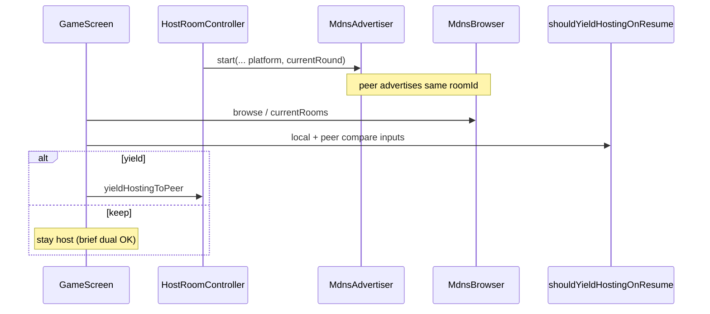

# Design: Stable dual-host tie-break

Replace turnSequence dual-acting heal with an antisymmetric compare over original → Android → `currentRound` → lex `hostIp:port`, fed by live mDNS TXT + local host fields. Prefer brief dual over zero-host (full tie → local keeps).

## Technical Approach

Pure domain compare + discovery TXT plumbing. `GameScreen._healHostingOnResume` already finds a peer ad; it MUST pass local/peer platform, round, and endpoints into an updated `shouldYieldHostingOnResume`. Advertiser MUST publish `platform` + `currentRound`; browser MUST map them onto `DiscoveredRoom`. Retire turnSequence from the dual-neither-original heal path only (election succession unchanged).

## Architecture Decisions

| Decision | Options | Choice | Why |
|----------|---------|--------|-----|
| Compare home | Extend `shouldYieldActingHost` vs new pure API on resume helper | New inputs on `shouldYieldHostingOnResume` (+ thin coordinator helper) | GameScreen already calls resume helper; turnSequence/peerId unused on-device |
| Peer original | TXT `hostPlayerId` vs local-original only | Local-original keep; no TXT player id | Locked; missing peer id OK for dual-non-original fix |
| Platform tokens | Freeform vs `android`\|`ios`\|`other` | Exact tokens; missing → `other` | Locked Android preference |
| Round default | Treat missing as keep vs `0` | Missing/unparseable → `0` | Locked; older peers lose round step |
| Endpoint order | Lower keeps vs higher keeps | Lex greater `hostIp:port` **keeps**; lesser yields; equal → local keeps | Matches “lex key wins”; antisymmetric; no mutual yield |
| TXT refresh | Only start/rename vs also on round change | Re-advertise when `currentRound` changes | Heal must see live round |
| Acceptance | Unit vs device E2E | Unit only | Locked narrow scope |

## Data Flow

```
HostRoomController.start / startFromSnapshot / _readvertiseMdns
        │  TXT: roomId, displayName, port, platform, currentRound
        ▼
   MdnsAdvertiser ──LAN──► MdnsBrowser._mapService ──► DiscoveredRoom
                                                          │
GameScreen._healHostingOnResume ◄── findLiveRoomAdvertisement
        │ local: Platform token, room.turnState.currentRound,
        │        "${hostLanIp}:${port}"
        │ peer:  room.platform, room.currentRound, "${hostIp}:${port}"
        ▼
shouldYieldHostingOnResume → yieldHostingToPeer | keep
```

**Keep order (first decisive):** (1) local original → keep; (2) Android over non-Android; (3) higher `currentRound`; (4) lex greater endpoint keeps; (5) full tie → local keeps.



## File Changes

| File | Action | Description |
|------|--------|-------------|
| `lib/core/domain/host_heal_compare.dart` (or coordinator) | Create/Modify | Pure parse + `shouldYieldDualHostHeal` ordered compare |
| `lib/core/domain/pause_gated_lifecycle.dart` | Modify | Resume API: platform/round/endpoints; drop turnSequence/peerId for dual path |
| `lib/core/domain/host_succession_coordinator.dart` | Modify | Retire turnSequence dual rule from `shouldYieldActingHost` or delegate to heal compare |
| `lib/core/models/discovered_room.dart` | Modify | Optional `platform`, `currentRound` + `copyWith` |
| `lib/core/network/discovery/mdns_advertiser.dart` | Modify | TXT `platform`, `currentRound` on `start` |
| `lib/core/network/discovery/mdns_browser.dart` | Modify | Parse attrs into `DiscoveredRoom` |
| `lib/server/host_room_controller.dart` | Modify | Pass token + round on all advertise sites; refresh TXT on round change |
| `lib/core/network/room_list_merger.dart` | Modify | Preserve new fields via `copyWith` |
| `lib/features/game/game_screen.dart` | Modify | Wire heal inputs from controller + peer room |
| `test/core/domain/pause_gated_lifecycle_test.dart` | Modify | Antisymmetric platform/round/endpoint + missing defaults + full tie |
| `test/core/domain/host_succession_coordinator_test.dart` | Modify | Drop/replace turnSequence dual cases |
| `test/server/host_room_controller_test.dart` | Modify | Fake advertiser captures platform/round |
| `test/core/room_list_merger_test.dart` | Modify | Preserve optional fields |
| `openspec/specs/host-succession/spec.md` | Modify (via delta) | Dual-acting scenario → stable key |
| `openspec/specs/lan-discovery/spec.md` | Modify (via delta) | Required TXT attrs |

## Interfaces / Contracts

```dart
// Tokens on the wire / DiscoveredRoom.platform
// "android" | "ios" | "other"  — absent/unknown → HostPlatformToken.other

bool shouldYieldHostingOnResume({
  required bool hasPeerAd,
  required String localPlayerId,
  required String? originalHostPlayerId,
  required String localPlatform,   // advertise token
  required int localCurrentRound,
  required String localEndpoint,   // "$ip:$port"
  required String? peerPlatform,   // TXT; null → other
  required int? peerCurrentRound,  // TXT; null/bad → 0
  required String peerEndpoint,
});

// MdnsAdvertiser.start adds:
//   platform: advertisePlatformToken(),  // Platform.isAndroid/iOS → token
//   currentRound: room.turnState.currentRound.toString(), // lobby: 0
```

**TXT refresh when:** `start`, `startFromSnapshot`, displayName rename (`_readvertiseMdns`), and whenever `currentRound` changes (`startNextRound` + round-closing pass). Track last advertised round to avoid no-op churn if desired.

## Testing Strategy

| Layer | What | Approach |
|-------|------|----------|
| Unit | Ordered compare steps + missing TXT + full tie local-keep + original keep | Table-driven on heal compare / `shouldYieldHostingOnResume` |
| Unit | Antisymmetry | Same pair swapped → exactly one yield |
| Unit | Advertiser args / browser map / merger preserve | Fake advertiser + pure map helper if extracted |
| Integration / E2E | — | Out of scope |

## Migration / Rollout

No schema migration. Older peers without TXT lose platform/round steps (treated non-Android / round 0); endpoint step still separates them. Rollback: revert heal API + drop TXT attrs.

## Open Questions

None — locked decisions applied. Spec agent owns requirement deltas in parallel.
